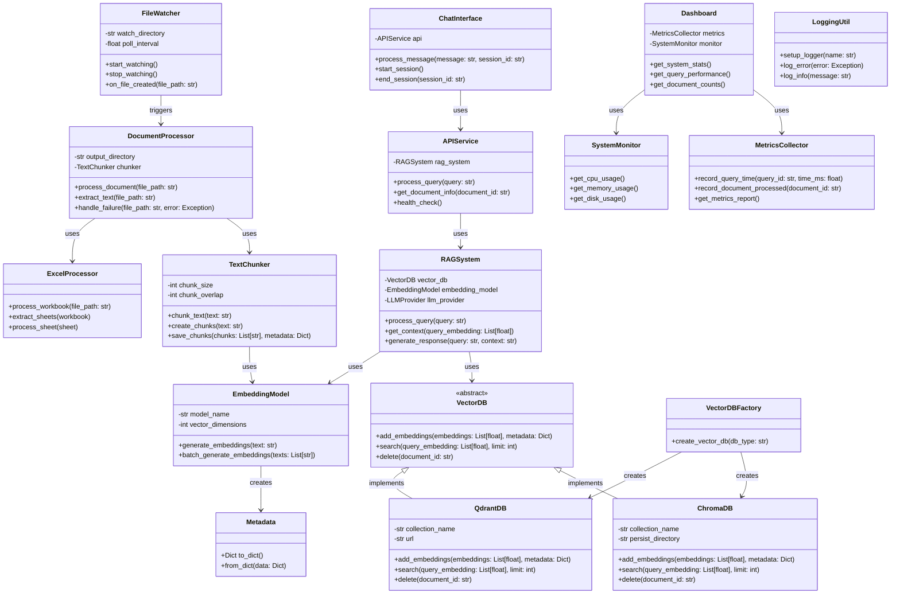

```mermaid
classDiagram
    %% Core Classes
    class RAGSystem {
        -VectorDB vector_db
        -EmbeddingModel embedding_model
        -LLMProvider llm_provider
        +process_query(query: str)
        +get_context(query_embedding: List[float])
        +generate_response(query: str, context: str)
    }
    
    %% Data Ingestion Classes
    class FileWatcher {
        -str watch_directory
        -float poll_interval
        +start_watching()
        +stop_watching()
        +on_file_created(file_path: str)
    }
    
    class DocumentProcessor {
        -str output_directory
        -TextChunker chunker
        +process_document(file_path: str)
        +extract_text(file_path: str)
        +handle_failure(file_path: str, error: Exception)
    }
    
    class ExcelProcessor {
        +process_workbook(file_path: str)
        +extract_sheets(workbook)
        +process_sheet(sheet)
    }
    
    class TextChunker {
        -int chunk_size
        -int chunk_overlap
        +chunk_text(text: str)
        +create_chunks(text: str)
        +save_chunks(chunks: List[str], metadata: Dict)
    }
    
    %% Model Classes
    class EmbeddingModel {
        -str model_name
        -int vector_dimensions
        +generate_embeddings(text: str)
        +batch_generate_embeddings(texts: List[str])
    }
    
    class Metadata {
        +Dict to_dict()
        +from_dict(data: Dict)
    }
    
    %% Vector Database Classes
    class VectorDB {
        <<abstract>>
        +add_embeddings(embeddings: List[float], metadata: Dict)
        +search(query_embedding: List[float], limit: int)
        +delete(document_id: str)
    }
    
    class ChromaDB {
        -str collection_name
        -str persist_directory
        +add_embeddings(embeddings: List[float], metadata: Dict)
        +search(query_embedding: List[float], limit: int)
        +delete(document_id: str)
    }
    
    class QdrantDB {
        -str collection_name
        -str url
        +add_embeddings(embeddings: List[float], metadata: Dict)
        +search(query_embedding: List[float], limit: int)
        +delete(document_id: str)
    }
    
    class VectorDBFactory {
        +create_vector_db(db_type: str)
    }
    
    %% Web & API Classes
    class APIService {
        -RAGSystem rag_system
        +process_query(query: str)
        +get_document_info(document_id: str)
        +health_check()
    }
    
    class ChatInterface {
        -APIService api
        +process_message(message: str, session_id: str)
        +start_session()
        +end_session(session_id: str)
    }
    
    class Dashboard {
        -MetricsCollector metrics
        -SystemMonitor monitor
        +get_system_stats()
        +get_query_performance()
        +get_document_counts()
    }
    
    %% Utility Classes
    class LoggingUtil {
        +setup_logger(name: str)
        +log_error(error: Exception)
        +log_info(message: str)
    }
    
    class MetricsCollector {
        +record_query_time(query_id: str, time_ms: float)
        +record_document_processed(document_id: str)
        +get_metrics_report()
    }
    
    class SystemMonitor {
        +get_cpu_usage()
        +get_memory_usage()
        +get_disk_usage()
    }
    
    %% Relationships
    RAGSystem --> VectorDB : uses
    RAGSystem --> EmbeddingModel : uses
    
    FileWatcher --> DocumentProcessor : triggers
    DocumentProcessor --> TextChunker : uses
    DocumentProcessor --> ExcelProcessor : uses
    
    TextChunker --> EmbeddingModel : uses
    EmbeddingModel --> Metadata : creates
    
    VectorDBFactory --> ChromaDB : creates
    VectorDBFactory --> QdrantDB : creates
    VectorDB <|-- ChromaDB : implements
    VectorDB <|-- QdrantDB : implements
    
    APIService --> RAGSystem : uses
    ChatInterface --> APIService : uses
    
    Dashboard --> MetricsCollector : uses
    Dashboard --> SystemMonitor : uses
```