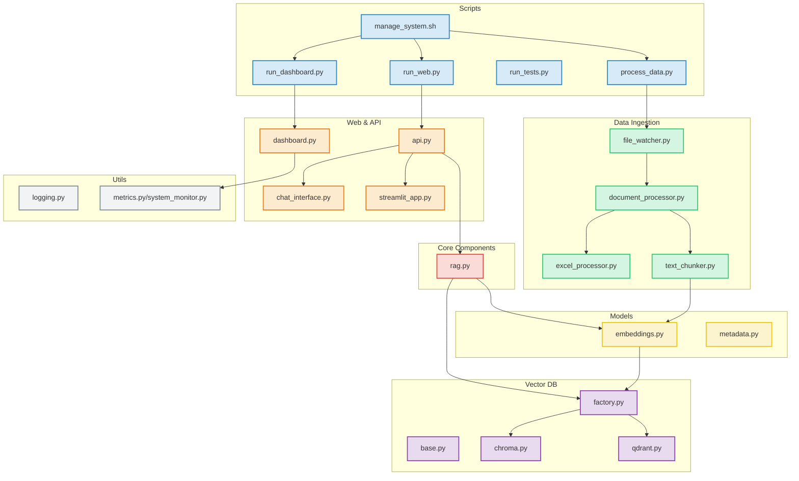

```mermaid
graph TB
    subgraph "Scripts"
        process_data[process_data.py]
        run_web[run_web.py]
        run_tests[run_tests.py]
        run_dashboard[run_dashboard.py]
        manage_system[manage_system.sh]
    end
    
    subgraph "Core Components"
        rag[rag.py]
    end
    
    subgraph "Data Ingestion"
        file_watcher[file_watcher.py]
        document_processor[document_processor.py]
        excel_processor[excel_processor.py]
        text_chunker[text_chunker.py]
    end
    
    subgraph "Models"
        embeddings[embeddings.py]
        metadata[metadata.py]
    end
    
    subgraph "Vector DB"
        db_base[base.py]
        db_chroma[chroma.py]
        db_qdrant[qdrant.py]
        db_factory[factory.py]
    end
    
    subgraph "Web & API"
        api[api.py]
        chat_interface[chat_interface.py]
        dashboard[dashboard.py]
        streamlit_app[streamlit_app.py]
    end
    
    subgraph "Utils"
        logging[logging.py]
        monitoring[metrics.py/system_monitor.py]
    end
    
    %% Connections
    manage_system --> process_data
    manage_system --> run_web
    manage_system --> run_dashboard
    
    process_data --> file_watcher
    file_watcher --> document_processor
    document_processor --> excel_processor
    document_processor --> text_chunker
    text_chunker --> embeddings
    embeddings --> db_factory
    db_factory --> db_chroma
    db_factory --> db_qdrant
    
    run_web --> api
    api --> rag
    rag --> embeddings
    rag --> db_factory
    
    api --> chat_interface
    api --> streamlit_app
    
    run_dashboard --> dashboard
    dashboard --> monitoring
    
    %% Style
    classDef script fill:#D6EAF8,stroke:#2E86C1,stroke-width:2px;
    classDef core fill:#FADBD8,stroke:#E74C3C,stroke-width:2px;
    classDef ingest fill:#D5F5E3,stroke:#2ECC71,stroke-width:2px;
    classDef model fill:#FCF3CF,stroke:#F1C40F,stroke-width:2px;
    classDef db fill:#E8DAEF,stroke:#8E44AD,stroke-width:2px;
    classDef web fill:#FDEBD0,stroke:#E67E22,stroke-width:2px;
    classDef util fill:#F2F3F4,stroke:#7F8C8D,stroke-width:2px;
    
    class process_data,run_web,run_tests,run_dashboard,manage_system script;
    class rag core;
    class file_watcher,document_processor,excel_processor,text_chunker ingest;
    class embeddings,metadata model;
    class db_base,db_chroma,db_qdrant,db_factory db;
    class api,chat_interface,dashboard,streamlit_app web;
    class logging,monitoring util;
```