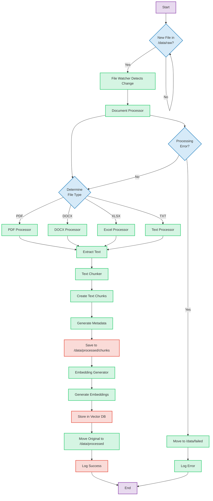

```mermaid
flowchart TD
    A[Start] --> B{New File in\n/data/raw?}
    B -->|Yes| C[File Watcher Detects Change]
    B -->|No| B
    
    C --> D[Document Processor]
    D --> E{Determine\nFile Type}
    
    E -->|PDF| F1[PDF Processor]
    E -->|DOCX| F2[DOCX Processor]
    E -->|XLSX| F3[Excel Processor]
    E -->|TXT| F4[Text Processor]
    
    F1 --> G[Extract Text]
    F2 --> G
    F3 --> G
    F4 --> G
    
    G --> H[Text Chunker]
    H --> I[Create Text Chunks]
    I --> J[Generate Metadata]
    J --> K[Save to /data/processed/chunks]
    
    K --> L[Embedding Generator]
    L --> M[Generate Embeddings]
    M --> N[Store in Vector DB]
    
    N --> O[Move Original to /data/processed]
    O --> P[Log Success]
    P --> Z[End]
    
    D --> D1{Processing\nError?}
    D1 -->|Yes| D2[Move to /data/failed]
    D1 -->|No| E
    
    D2 --> D3[Log Error]
    D3 --> Z
    
    classDef process fill:#D5F5E3,stroke:#2ECC71,stroke-width:2px;
    classDef decision fill:#D6EAF8,stroke:#2E86C1,stroke-width:2px;
    classDef io fill:#FADBD8,stroke:#E74C3C,stroke-width:2px;
    classDef terminal fill:#E8DAEF,stroke:#8E44AD,stroke-width:2px;
    
    class A,Z terminal;
    class B,E,D1 decision;
    class C,D,F1,F2,F3,F4,G,H,I,J,L,M,O,D2,D3 process;
    class K,N,P io;
```