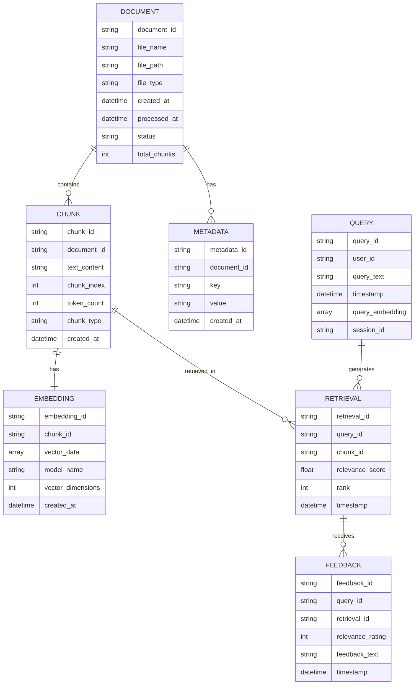

```mermaid
erDiagram
    DOCUMENT ||--o{ CHUNK : contains
    CHUNK ||--|| EMBEDDING : has
    DOCUMENT {
        string document_id
        string file_name
        string file_path
        string file_type
        datetime created_at
        datetime processed_at
        string status
        int total_chunks
    }
    CHUNK {
        string chunk_id
        string document_id
        string text_content
        int chunk_index
        int token_count
        string chunk_type
        datetime created_at
    }
    EMBEDDING {
        string embedding_id
        string chunk_id
        array vector_data
        string model_name
        int vector_dimensions
        datetime created_at
    }
    METADATA {
        string metadata_id
        string document_id
        string key
        string value
        datetime created_at
    }
    DOCUMENT ||--o{ METADATA : has
    
    QUERY {
        string query_id
        string user_id
        string query_text
        datetime timestamp
        array query_embedding
        string session_id
    }
    
    RETRIEVAL {
        string retrieval_id
        string query_id
        string chunk_id
        float relevance_score
        int rank
        datetime timestamp
    }
    
    FEEDBACK {
        string feedback_id
        string query_id
        string retrieval_id
        int relevance_rating
        string feedback_text
        datetime timestamp
    }
    
    QUERY ||--o{ RETRIEVAL : generates
    RETRIEVAL ||--o{ FEEDBACK : receives
    CHUNK ||--o{ RETRIEVAL : retrieved_in
```