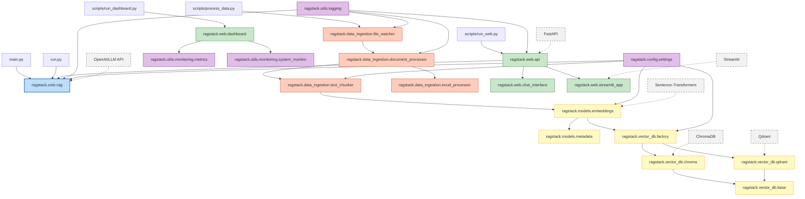

```mermaid
flowchart TD
    %% Core Dependencies
    main.py --> ragstack.core.rag
    run.py --> ragstack.core.rag
    
    %% Data Ingestion Dependencies
    scripts/process_data.py --> ragstack.data_ingestion.file_watcher
    ragstack.data_ingestion.file_watcher --> ragstack.data_ingestion.document_processor
    ragstack.data_ingestion.document_processor --> ragstack.data_ingestion.text_chunker
    ragstack.data_ingestion.document_processor --> ragstack.data_ingestion.excel_processor
    
    %% Model Dependencies
    ragstack.data_ingestion.text_chunker --> ragstack.models.embeddings
    ragstack.models.embeddings --> ragstack.models.metadata
    
    %% Vector DB Dependencies
    ragstack.models.embeddings --> ragstack.vector_db.factory
    ragstack.vector_db.factory --> ragstack.vector_db.chroma
    ragstack.vector_db.factory --> ragstack.vector_db.qdrant
    ragstack.vector_db.chroma --> ragstack.vector_db.base
    ragstack.vector_db.qdrant --> ragstack.vector_db.base
    
    %% Web & API Dependencies
    scripts/run_web.py --> ragstack.web.api
    ragstack.web.api --> ragstack.web.chat_interface
    ragstack.web.api --> ragstack.web.streamlit_app
    ragstack.web.api --> ragstack.core.rag
    
    %% Dashboard & Monitoring
    scripts/run_dashboard.py --> ragstack.web.dashboard
    ragstack.web.dashboard --> ragstack.utils.monitoring.metrics
    ragstack.web.dashboard --> ragstack.utils.monitoring.system_monitor
    
    %% Utils Dependencies
    ragstack.utils.logging --> ragstack.data_ingestion.document_processor
    ragstack.utils.logging --> ragstack.data_ingestion.file_watcher
    ragstack.utils.logging --> ragstack.core.rag
    ragstack.utils.logging --> ragstack.web.api
    
    %% Config Dependencies
    ragstack.config.settings --> ragstack.core.rag
    ragstack.config.settings --> ragstack.vector_db.factory
    ragstack.config.settings --> ragstack.models.embeddings
    ragstack.config.settings --> ragstack.data_ingestion.text_chunker
    
    %% External Dependencies
    ext_chromadb[ChromaDB] -.-> ragstack.vector_db.chroma
    ext_qdrant[Qdrant] -.-> ragstack.vector_db.qdrant
    ext_sentence[Sentence-Transformers] -.-> ragstack.models.embeddings
    ext_llm[OpenAI/LLM API] -.-> ragstack.core.rag
    ext_streamlit[Streamlit] -.-> ragstack.web.streamlit_app
    ext_fastapi[FastAPI] -.-> ragstack.web.api
    
    %% Styling
    classDef external fill:#f2f2f2,stroke:#333,stroke-width:1px,stroke-dasharray: 5 5;
    classDef core fill:#bbdefb,stroke:#1565c0,stroke-width:2px;
    classDef web fill:#c8e6c9,stroke:#2e7d32,stroke-width:1px;
    classDef data fill:#ffccbc,stroke:#bf360c,stroke-width:1px;
    classDef model fill:#fff9c4,stroke:#f9a825,stroke-width:1px;
    classDef util fill:#e1bee7,stroke:#6a1b9a,stroke-width:1px;
    
    class ext_chromadb,ext_qdrant,ext_sentence,ext_llm,ext_streamlit,ext_fastapi external;
    class ragstack.core.rag core;
    class ragstack.web.api,ragstack.web.chat_interface,ragstack.web.streamlit_app,ragstack.web.dashboard web;
    class ragstack.data_ingestion.file_watcher,ragstack.data_ingestion.document_processor,ragstack.data_ingestion.text_chunker,ragstack.data_ingestion.excel_processor data;
    class ragstack.models.embeddings,ragstack.models.metadata,ragstack.vector_db.chroma,ragstack.vector_db.qdrant,ragstack.vector_db.base,ragstack.vector_db.factory model;
    class ragstack.utils.logging,ragstack.utils.monitoring.metrics,ragstack.utils.monitoring.system_monitor,ragstack.config.settings util;
```