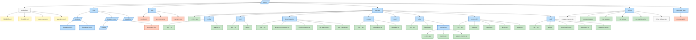

```mermaid
graph TD
    root[/rag-poc/] --> data
    root --> ragstack
    root --> scripts
    root --> logs
    root --> chromadb_data
    root --> config_files[config files]
    
    config_files --> readme[README.md]
    config_files --> claude[CLAUDE.md]
    config_files --> requirements[requirements.txt]
    config_files --> pyproject[pyproject.toml]
    
    data --> raw[/data/raw/]
    data --> processed[/data/processed/]
    data --> failed[/data/failed/]
    
    raw --> templates_pdf[Templates PDF/]
    raw --> templates_xlsx[Templates XLSX/]
    
    processed --> chunks[/chunks/]
    processed --> doc_files[Document Files]
    
    logs --> metrics_db[metrics.db]
    logs --> processing_log[processing.log]
    logs --> ragstack_log[ragstack.log]
    
    ragstack --> ragstack_init[__init__.py]
    ragstack --> config[config/]
    ragstack --> core[core/]
    ragstack --> data_ingestion[data_ingestion/]
    ragstack --> models[models/]
    ragstack --> tests[tests/]
    ragstack --> utils[utils/]
    ragstack --> vector_db[vector_db/]
    ragstack --> web[web/]
    
    config --> config_init[__init__.py]
    config --> settings[settings.py]
    
    core --> core_init[__init__.py]
    core --> rag[rag.py]
    
    data_ingestion --> di_init[__init__.py]
    data_ingestion --> doc_processor[document_processor.py]
    data_ingestion --> excel_processor[excel_processor.py]
    data_ingestion --> file_watcher[file_watcher.py]
    data_ingestion --> text_chunker[text_chunker.py]
    
    models --> models_init[__init__.py]
    models --> embeddings[embeddings.py]
    models --> metadata_model[metadata.py]
    
    utils --> utils_init[__init__.py]
    utils --> logging_util[logging.py]
    utils --> monitoring[monitoring/]
    
    monitoring --> monitoring_init[__init__.py]
    monitoring --> metrics[metrics.py]
    monitoring --> system_monitor[system_monitor.py]
    
    vector_db --> vdb_init[__init__.py]
    vector_db --> base[base.py]
    vector_db --> chroma[chroma.py]
    vector_db --> factory[factory.py]
    vector_db --> qdrant[qdrant.py]
    
    web --> web_init[__init__.py]
    web --> api[api.py]
    web --> chat_interface[chat_interface.py]
    web --> dashboard[dashboard.py]
    web --> streamlit_app[streamlit_app.py]
    
    scripts --> manage_system[manage_system.sh]
    scripts --> process_data[process_data.py]
    scripts --> run_tests[run_tests.py]
    scripts --> run_web[run_web.py]
    scripts --> run_dashboard[run_dashboard.py]
    scripts --> other_scripts[Other utility scripts]
    
    chromadb_data --> chroma_sqlite[chroma.sqlite3]
    
    classDef default fill:#f9f9f9,stroke:#333,stroke-width:1px;
    classDef directory fill:#bbdefb,stroke:#1565c0,stroke-width:2px;
    classDef pythonFile fill:#c8e6c9,stroke:#2e7d32,stroke-width:1px;
    classDef configFile fill:#fff9c4,stroke:#f9a825,stroke-width:1px;
    classDef dataFile fill:#ffccbc,stroke:#bf360c,stroke-width:1px;
    
    class root,data,ragstack,scripts,logs,chromadb_data,config,core,data_ingestion,models,tests,utils,vector_db,web,raw,processed,failed,chunks,templates_pdf,templates_xlsx,monitoring directory;
    class ragstack_init,config_init,settings,core_init,rag,di_init,doc_processor,excel_processor,file_watcher,text_chunker,models_init,embeddings,metadata_model,utils_init,logging_util,monitoring_init,metrics,system_monitor,vdb_init,base,chroma,factory,qdrant,web_init,api,chat_interface,dashboard,streamlit_app,process_data,run_tests,run_web,run_dashboard pythonFile;
    class readme,claude,requirements,pyproject configFile;
    class metrics_db,processing_log,ragstack_log,doc_files,chroma_sqlite dataFile;
```