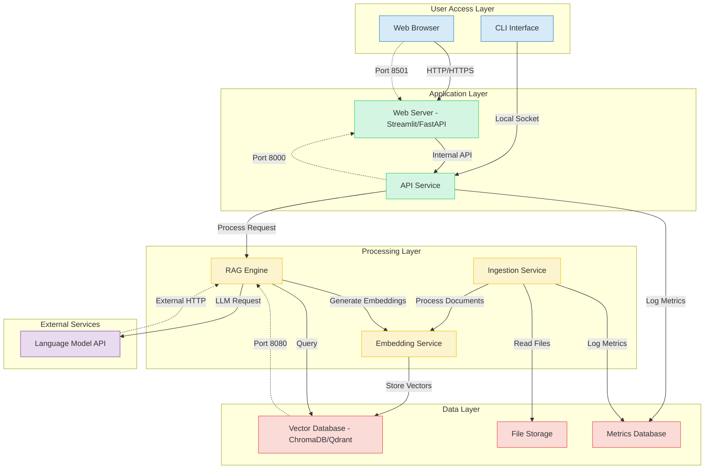

```mermaid
graph TB
    subgraph "User Access Layer"
        browser[Web Browser]
        cli[CLI Interface]
    end
    
    subgraph "Application Layer"
        webserver[Web Server - Streamlit/FastAPI]
        api[API Service]
    end
    
    subgraph "Processing Layer"
        ingest[Ingestion Service]
        rag_engine[RAG Engine]
        embedding[Embedding Service]
    end
    
    subgraph "Data Layer"
        vector_db[Vector Database - ChromaDB/Qdrant]
        file_storage[File Storage]
        metrics_db[Metrics Database]
    end
    
    subgraph "External Services"
        llm[Language Model API]
    end
    
    %% Connections
    browser -->|HTTP/HTTPS| webserver
    cli -->|Local Socket| api
    
    webserver -->|Internal API| api
    api -->|Process Request| rag_engine
    
    ingest -->|Read Files| file_storage
    ingest -->|Process Documents| embedding
    embedding -->|Store Vectors| vector_db
    
    rag_engine -->|Query| vector_db
    rag_engine -->|Generate Embeddings| embedding
    rag_engine -->|LLM Request| llm
    
    api -->|Log Metrics| metrics_db
    ingest -->|Log Metrics| metrics_db
    
    %% Network Info
    browser -.->|Port 8501| webserver
    api -.->|Port 8000| webserver
    vector_db -.->|Port 8080| rag_engine
    llm -.->|External HTTP| rag_engine
    
    %% Styles
    classDef browser fill:#D6EAF8,stroke:#2E86C1;
    classDef server fill:#D5F5E3,stroke:#2ECC71;
    classDef db fill:#FADBD8,stroke:#E74C3C;
    classDef service fill:#FCF3CF,stroke:#F1C40F;
    classDef external fill:#E8DAEF,stroke:#8E44AD;
    
    class browser,cli browser;
    class webserver,api server;
    class vector_db,file_storage,metrics_db db;
    class ingest,rag_engine,embedding service;
    class llm external;
```