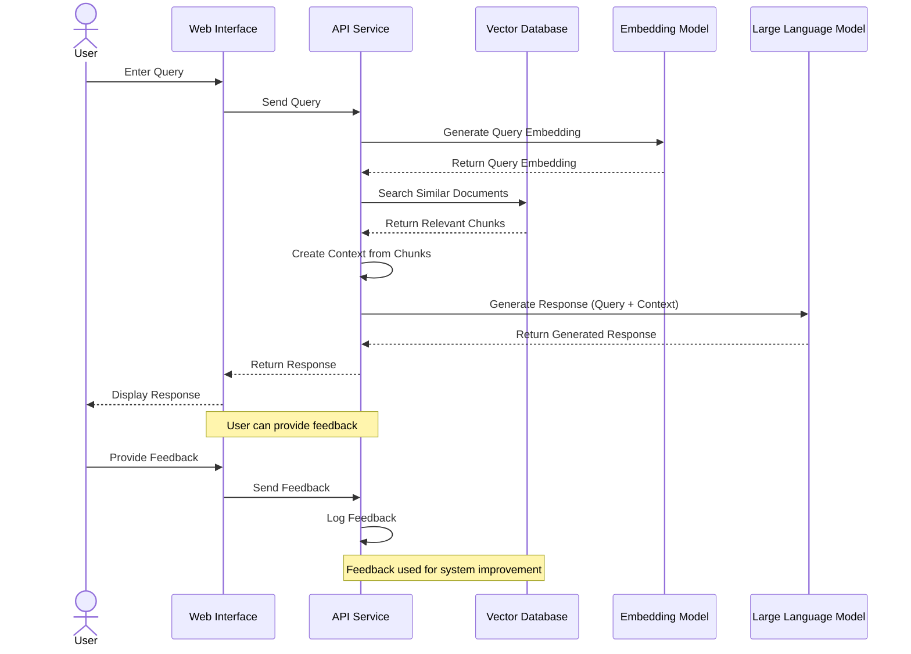

```mermaid
sequenceDiagram
    actor User
    participant UI as Web Interface
    participant API as API Service
    participant VDB as Vector Database
    participant EM as Embedding Model
    participant LLM as Large Language Model
    
    User->>UI: Enter Query
    UI->>API: Send Query
    
    API->>EM: Generate Query Embedding
    EM-->>API: Return Query Embedding
    
    API->>VDB: Search Similar Documents
    VDB-->>API: Return Relevant Chunks
    
    API->>API: Create Context from Chunks
    
    API->>LLM: Generate Response (Query + Context)
    LLM-->>API: Return Generated Response
    
    API-->>UI: Return Response
    UI-->>User: Display Response
    
    Note over UI,API: User can provide feedback
    
    User->>UI: Provide Feedback
    UI->>API: Send Feedback
    API->>API: Log Feedback
    
    Note over API,VDB: Feedback used for system improvement
```