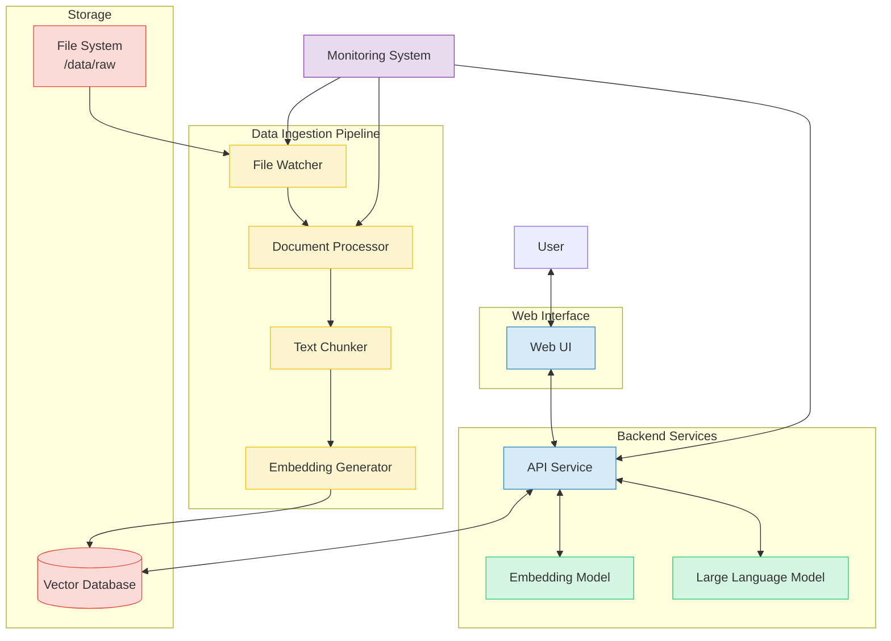

```mermaid
graph TD
    User[User] <--> WebUI[Web UI]
    WebUI <--> API[API Service]
    API <--> VectorDB[(Vector Database)]
    API <--> EmbeddingModel[Embedding Model]
    API <--> LLM[Large Language Model]
    
    FileSystem[File System\n/data/raw] --> FileWatcher[File Watcher]
    FileWatcher --> DocumentProcessor[Document Processor]
    DocumentProcessor --> TextChunker[Text Chunker]
    TextChunker --> EmbeddingGenerator[Embedding Generator]
    EmbeddingGenerator --> VectorDB
    
    subgraph "Web Interface"
        WebUI
    end
    
    subgraph "Backend Services"
        API
        EmbeddingModel
        LLM
    end
    
    subgraph "Data Ingestion Pipeline"
        FileWatcher
        DocumentProcessor
        TextChunker
        EmbeddingGenerator
    end
    
    subgraph "Storage"
        FileSystem
        VectorDB
    end
    
    Monitoring[Monitoring System] --> API
    Monitoring --> FileWatcher
    Monitoring --> DocumentProcessor
    
    style WebUI fill:#D6EAF8,stroke:#2E86C1
    style API fill:#D6EAF8,stroke:#2E86C1
    style VectorDB fill:#FADBD8,stroke:#E74C3C
    style EmbeddingModel fill:#D5F5E3,stroke:#2ECC71
    style LLM fill:#D5F5E3,stroke:#2ECC71
    style FileSystem fill:#FADBD8,stroke:#E74C3C
    style FileWatcher fill:#FCF3CF,stroke:#F1C40F
    style DocumentProcessor fill:#FCF3CF,stroke:#F1C40F
    style TextChunker fill:#FCF3CF,stroke:#F1C40F
    style EmbeddingGenerator fill:#FCF3CF,stroke:#F1C40F
    style Monitoring fill:#E8DAEF,stroke:#8E44AD
```